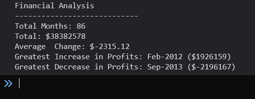

# Console Finances

## Description

The aim of this project is to take a financial dataset and calculate the following:
- The total number of months included in the dataset.
- The net total amount of Profit/Losses over the entire period.
- The average of the changes in Profit/Losses over the entire period.[^1]
- The greatest increase in profits (date and amount) over the entire period.[^2]
- The greatest decrease in profits (date and amount) over the entire period.[^2] [^3]

I have made a number of assumptions with regards to the dataset, they are:
- Each month/year appears only once in the dataset.
- The month/years are contiguous.
- The dataset is ordered ascending by the month/year.

The output of the analysis appears like this in the console.

The live page can be found here, [https://fezzer.github.io/console-finances/](https://fezzer.github.io/console-finances/).

[^1]: There is an error in this calculation provided in the challenge documentation. The average calculation ***should*** be `Total / (Number of months - 1)` as there is one less 'changes between the months' than there are months in the list. This is the calculation I have used in my code.

[^2]: The challenge documentation is unclear as to which month/year should be reported as part of this result. I have decided to use the latter of the month/year pair.

[^3]: There is an error in the challenge documentation in this requirement. I have corrected it in this documentation following the guidance of the course tutor.

## Usage

Navigate to the live page, the output of the analysis can be found in the browser's console.

## License

Please refer to the license in the repo.